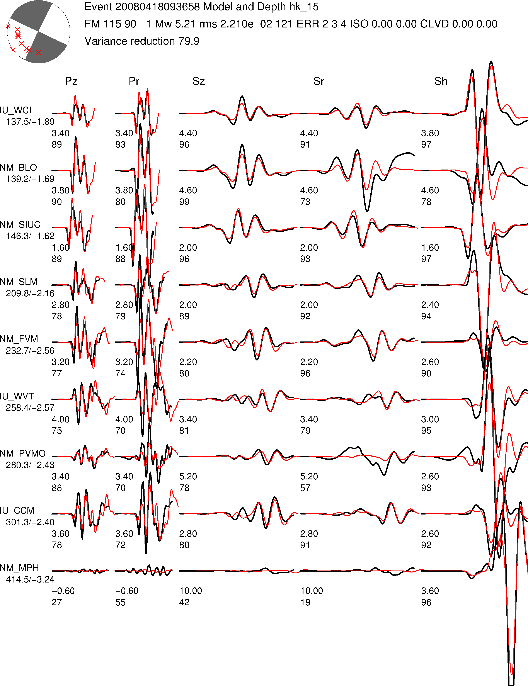
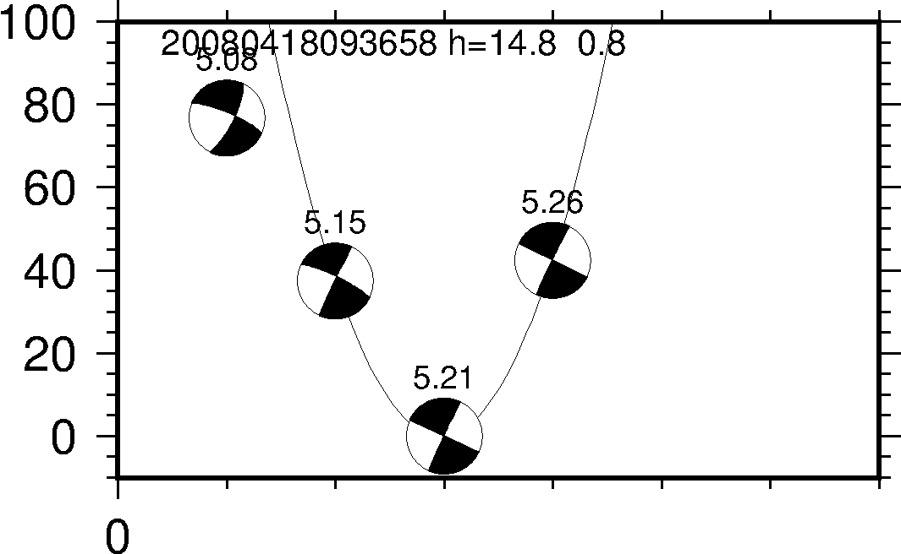

# 快速开始

Oh My CAP 中自带了一个示例事件，你可以按照如下步骤依次执行命令得到该事件的震源机制解，以验证所有程序都正确安装并对整个流程有初步的认识。

```
# 进入 Glib/model 目录，生成格林函数
$ cd Glib/model/
$ perl run_fk.pl

# 进入 example 目录
$ cd ../../example/

# 对示例数据进行预处理
$ perl process.pl 20080418093658

# 生成权重文件
$ perl weight.pl 20080418093658

# 反演并查看反演结果
$ perl inversion.pl 20080418093658
$ gs 20080418093658/model_*.ps

# 绘制并查看深度反演结果
$ perl get_depth.pl 20080418093658
$ gs 20080418093658/depth.ps
```

下图展示了震源深度固定为 15 km 时的震源机制反演结果（即 `20080418093658/model_15.ps`）：


下图展示了不同震源深度的反演结果（即 `20080418093658/depth.ps`）：

